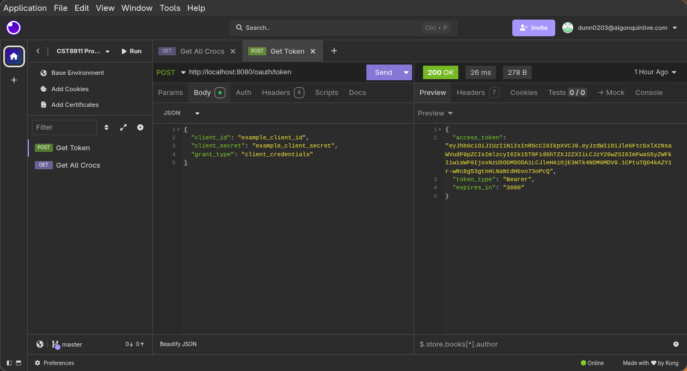
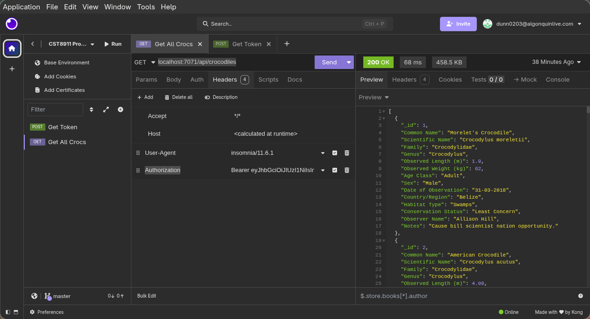

# OAuth Server Setup Guide

This directory contains a simple OAuth 2.0 server written in TypeScript, and
instructions for integrating it with an Azure Functions HTTP API.

## Prerequisites

Follow instructions in the functions and db directories first. This will ensure
that you have the following on your machine:

- Node.js
- npm
- MongoDB with the `Crocs` database
- Azure Functions Core Tools

## 1. Setting Up the OAuth Server

1. Navigate to the OAuth server folder:

```bash
cd oauth
```

2. Install the server dependencies

```bash
npm install
```

This will install all dependencies

3. Configure environment variables for the server

In the root directory of the oauth server, create a `.env` file with the
following content

```
PORT=8080
JWT_SECRET=example_jwt_secret
CLIENT_ID=example_client_id
CLIENT_SECRET=example_client_secret
TOKEN_EXPIRY=3600
```

I will eventually use proper credential storage for the client ID and secret.
The `JWT_SECRET` must match the config in the functions.

4. Start the OAuth server

```bash
npx ts-node src/index.ts
```

You should see the following message:

```
OAuth server running on port 8080
```

## 2. Setting Up Azure Functions

1. In a new terminal window, navigate to the Azure Functions directory

```bash
cd alice_functions/CRUDfunctions
```

2. Install the required dependencies for the functions app

```bash
npm install
```

I've added `jsonwebtoken` as a dependency to the functions. Even with a
previously configured environment you will need to run this command to install
the new dependency.

3. Start the Azure Functions host locally:

```bash
func start
```

## 3. Using Insomnia with the Functions

### Request a token from the OAuth server

1. In Insomnia, create a new `POST` request.

2. Copy the following route into the URL:

```
http://localhost:8080/oauth/token
```

3. In the Body tab, set the body type to `JSON` and copy the following body:

```JSON
{
  "client_id": "example_client_id",
  "client_secret": "example_client_secret",
  "grant_type": "client_credentials"
}
```

The `client_id` and `client_secret` must match what you set in the `.env` of
the OAuth server.

4. Send the request and copy the token



### Use token to authenticate API request

1. In Insomnia, create a new `GET` request.

2. Copy the following route into the URL:

```
localhost:7071/api/crocodiles
```

3. In the Headers tab, add a new header:

The key for the header will be:

```
Authorization
```

For the value, use the following format, replacing `<COPIED AUTH TOKEN>` with
the token you received previously:

```
Bearer <COPIED AUTH TOKEN>
```

4. Send the request, you should get a response with all the crocodile data.


